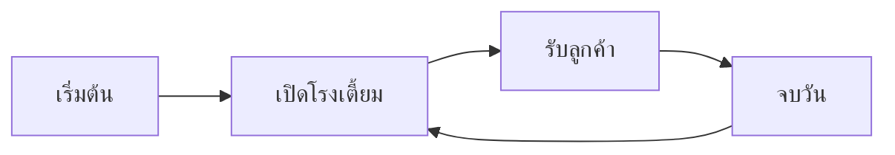

# [Mizar's Tavern] — Core Loop & Gameplay

## Core Loop

## Core Mechanics

1. การพูดคุยกับลูกค้าแต่ล่ะคนที่จะมีเนื้อเรื่องของตนเองและระบบความสัมพันธ์
2. การจัดการสินค้าหลังร้านและEvent ที่จะส่งผลกับสินค้าในร้าน
3. Minigame ทำอาหาร

## Controls

| Key   | Action   |
| ----- | -------- |
| Mouse | interact |

## Win / Lose Condition

- **ชนะเมื่อ:** เมื่อขายจบวันได้กำไร
- **แพ้เมื่อ:** เงินหมดล้มละลาย
