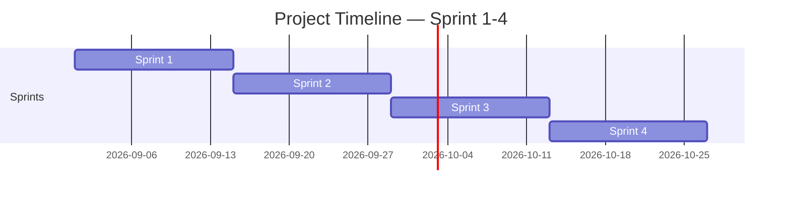

<!-- Template เต็มไฟล์สำหรับสร้าง docs/agile/02-sprint-backlog.md -->

<!-- ภาพรวมว่า Story ไหนไปอยู่ Sprint ไหนตลอด 4 Sprint — ไม่ต้องระบุคนรับผิดชอบ/Status ที่นี่ ส่วนนั้นอยู่ใน sprint-plan-[NN].md ของ Sprint ที่กำลังทำ -->

# Sprint Backlog

**Version:** 1.1 | **Last Updated:** 2026-09-22

> ภาพรวมว่า User Story ไหนจาก `01-product-backlog.md` จะไปอยู่ Sprint ไหน — Sprint ที่ยังไม่ถึงคือ draft คร่าวๆ ปรับได้เสมอเมื่อเข้าใจงานมากขึ้น

## Timeline (4 Sprint, Sprint ละ 2 สัปดาห์)

| Sprint   | เริ่ม | สิ้นสุด |
| -------- | ---------- | -------------- |
| Sprint 1 | 2026-09-01 | 2026-09-14     |
| Sprint 2 | 2026-09-15 | 2026-09-28     |
| Sprint 3 | 2026-09-29 | 2026-10-12     |
| Sprint 4 | 2026-10-13 | 2026-10-26     |

> ปรับวันที่ให้ตรงกับวันที่ทีมเริ่มลงมือทำจริง (ถ้าไม่ใช่วันแลปนี้)

## Sprint 1 (กำลังทำ)

| # | User Story | MoSCoW | Estimate (SP) |
| - | ---------- | ------ | ------------- |
| 1 | ระบบนับจังหวะ 8 ช่องแบบเมโทรโนม | Must Have | 3 |
| 2 | ระบบดันคะแนนที่อิงจาก 8 ช่อง | Must Have | 2 |
| 3 | การวางตัวละคร | Must Have | 4 |
| 4 | Asset Sound & Music *(บางส่วน)* | Must Have | 4 |
| 5 | Sprite ของนักดนตรี (ตัวละคร) *(บางส่วน)* | Must Have | 2 |
| 6 | Art ในเกม *(บางส่วน)* | Must Have | 3 |
| 7 | ตัวละครแต่ละประเภท | Should Have | 3 |
| 8 | UI ในเกม | Should Have | 2 |
| 9 | บัฟต่างๆ ของนักดนตรีแต่ละสาย *(บางส่วน)* | Should Have | 2 |
| 10 | บอสในเกม | Should Have | 3 |
| 11 | ระบบเลือกวาทยกร (Conductor) | รอจัด | - |
| 12 | ระบบแผนที่เส้นทาง / Floor | รอจัด | - |
| 13 | ระบบเลือกยุค (Era) | รอจัด | - |
| 14 | ระบบรับนักดนตรีเข้าวง (Recruit) | รอจัด | - |
| 15 | ตั้งชื่อวง | รอจัด | - |
| 16 | ระบบเขียนโน้ต (Score) | รอจัด | - |
| 17 | ระบบ QTE + Combo | รอจัด | - |
| 18 | ระบบ Stamina | รอจัด | - |
| 19 | ระบบ Motif (ไอเทมติดตัว) | รอจัด | - |
| 20 | ร้านค้า (Shop) | รอจัด | - |
| 21 | จุดพัก (Rest) | รอจัด | - |
| 22 | ระบบ Event | รอจัด | - |
| 23 | ศัตรูทั่วไปและ Elite | รอจัด | - |
| 24 | หน้าสอนเล่น (Guide) | รอจัด | - |
| 25 | หน้าผลการต่อสู้ + สรุปจบรัน | รอจัด | - |

> รวม SP ที่ประเมินแล้ว = 28 SP (ข้อ 11-25 ยังไม่มี SP รอทีมกรอก)
> *(บางส่วน)* = มีในโค้ดแต่ยังไม่ครบ — Sound: ระบบพร้อมแต่ยังไม่มีไฟล์เสียง/เพลง / Sprite และ Art: ยังเป็น placeholder วาดด้วยโค้ด / บัฟ: มีเฉพาะผ่าน Motif และวาทยกร THE FOLK LEADER — รายละเอียดดูคอลัมน์ `สถานะ` ใน `01-product-backlog.md`

## Sprint 2 (Draft)

| # | User Story | MoSCoW | Estimate (SP) |
| - | ---------- | ------ | ------------- |
|   |            |        |               |

## Sprint 3 (Draft)

| # | User Story | MoSCoW | Estimate (SP) |
| - | ---------- | ------ | ------------- |
|   |            |        |               |

## Sprint 4 (Draft)

| # | User Story | MoSCoW | Estimate (SP) |
| - | ---------- | ------ | ------------- |
|   |            |        |               |

> Story ที่ยังไม่ได้ทำและยังไม่ได้จัดลง Sprint: ระบบเลือกตัวละคร 1 ใน 3 (Must, 4 SP), Story (Should, 1 SP), ตกแต่ง Art เพิ่ม (Nice, 1 SP), เพิ่มระบบ Setting UI (Nice, 3 SP), save game (Nice, 3 SP) — รวม 12 SP

> **Sprint 2-4 คือ draft ระดับ release plan** — เป้าหมายคือฝึกกะจำนวน SP ต่อ Sprint ให้ใกล้เคียง capacity ของทีม ไม่ใช่ล็อก scope ตายตัว ปรับได้ทุกครั้งที่ทำ Sprint Planning ของ Sprint ถัดไป
>
> เมื่อ Sprint ไหนเริ่มทำงานจริง ให้คัดลอก template `sprint-plan-template.md` (ไฟล์แนบใน LMS) ไปสร้าง `docs/agile/sprint-plan-[NN].md` แล้วดึง Story ของ Sprint นั้นจากตารางด้านบนมาใส่คนรับผิดชอบ แตก Task และปรับ Estimate ให้ละเอียดขึ้น

## Links

- [[docs/agile/01-product-backlog|Product Backlog]]
- [[docs/agile/sprint-plan-01|Sprint 1 Plan]]
