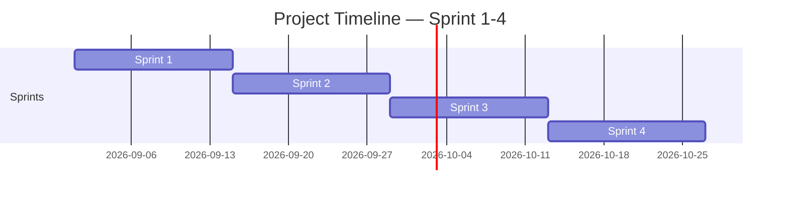

<!-- Template เต็มไฟล์สำหรับสร้าง docs/agile/02-sprint-backlog.md -->

<!-- ภาพรวมว่า Story ไหนไปอยู่ Sprint ไหนตลอด 4 Sprint — ไม่ต้องระบุคนรับผิดชอบ/Status ที่นี่ ส่วนนั้นอยู่ใน sprint-plan-[NN].md ของ Sprint ที่กำลังทำ -->

# Sprint Backlog

**Version:** 1.0 | **Last Updated:** 2026-09-01

> ภาพรวมว่า User Story ไหนจาก `01-product-backlog.md` จะไปอยู่ Sprint ไหน — Sprint ที่ยังไม่ถึงคือ draft คร่าวๆ ปรับได้เสมอเมื่อเข้าใจงานมากขึ้น

## Timeline (4 Sprint, Sprint ละ 2 สัปดาห์)

| Sprint   | เริ่ม | สิ้นสุด |
| -------- | ---------- | -------------- |
| Sprint 1 | 2026-09-01 | 2026-09-14     |
| Sprint 2 | 2026-09-15 | 2026-09-28     |
| Sprint 3 | 2026-09-29 | 2026-10-12     |
| Sprint 4 | 2026-10-13 | 2026-10-26     |

> ปรับวันที่ให้ตรงกับวันที่ทีมเริ่มลงมือทำจริง (ถ้าไม่ใช่วันแลปนี้)

## Sprint 1 (กำลังทำ)

| # | User Story                                                  | MoSCoW    | Estimate (SP) |
| - | ----------------------------------------------------------- | --------- | ------------- |
| 1 | ระบบนับจังหวะ 8 ช่องแบบเมโทรโนม | Must Have | 3             |
| 2 | ระบบดันคะแนนที่อิงจาก 8 ช่อง       | Must Have | 2             |
| 3 | การวางตัวละคร                                  | Must Have | 4             |
| 4 | Asset Sound & Music                                         | Must Have | 4             |
| 5 | Sprite ของนักดนตรี(ตัวละคร)               | Must Have | 2             |
| 6 | Art ในเกม                                              | Must Have | 3             |

## Sprint 2 (Draft)

| # | User Story                                             | MoSCoW      | Estimate (SP) |
| - | ------------------------------------------------------ | ----------- | ------------- |
| 1 | ระบบเลือกตัวละคร 1 ใน 3              | Must Have   | 4             |
| 2 | ตัวละครแต่ละประเภท                   | Should Have |  3       |
| 3 | บัฟต่างๆของนักดนตรีแต่ละสาย | Should Have | 2             |
| 4 | บอสในเกม                                       | Should Have | 2             |

## Sprint 3 (Draft)

| # | User Story    | MoSCoW       | Estimate (SP) |
| - | ------------- | ------------ | ------------- |
| 1 | UI ในเกม | Should Have  | 2             |
| 2 | Story         | Should Have  | 1             |
| 3 | save game     | Nice to Have | 3             |

## Sprint 4 (Draft)

| # | User Story                    | MoSCoW       | Estimate (SP) |
| - | ----------------------------- | ------------ | ------------- |
| 1 | ตกแต่ง Art เพิ่ม   | Nice to Have | 1             |
| 2 | เพิ่มระบบ Setting UI | Nice to Have | 3             |

> **Sprint 2-4 คือ draft ระดับ release plan** — เป้าหมายคือฝึกกะจำนวน SP ต่อ Sprint ให้ใกล้เคียง capacity ของทีม ไม่ใช่ล็อก scope ตายตัว ปรับได้ทุกครั้งที่ทำ Sprint Planning ของ Sprint ถัดไป
>
> เมื่อ Sprint ไหนเริ่มทำงานจริง ให้คัดลอก template `sprint-plan-template.md` (ไฟล์แนบใน LMS) ไปสร้าง `docs/agile/sprint-plan-[NN].md` แล้วดึง Story ของ Sprint นั้นจากตารางด้านบนมาใส่คนรับผิดชอบ แตก Task และปรับ Estimate ให้ละเอียดขึ้น

## Links

- [[docs/agile/01-product-backlog|Product Backlog]]
- [[docs/agile/sprint-plan-01|Sprint 1 Plan]]
