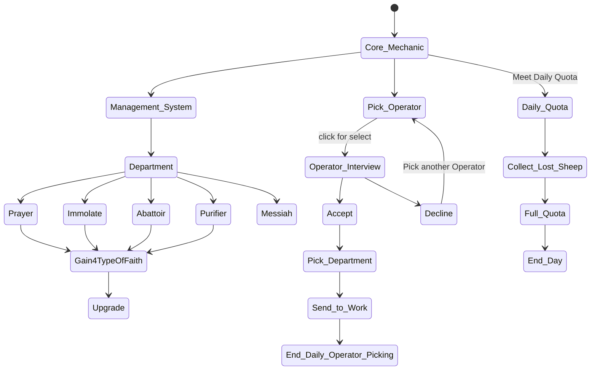

# Mechanic Design — [ไม่มี]

## State Diagram

## Rules

| State        | เข้าเงื่อนไข | ออกเงื่อนไข   | Note |
| ------------ | ------------------------ | ------------------------ | ---- |
| Daily Quota  | เริ่มทำงาน     | เก็บแต้มครบ   | -    |
| Upgrade      | จบวัน               | อัพเกรดเสร็จ | -    |
| PickOperator | เรื่มวัน         | เลือกเสร็จ     | -    |
