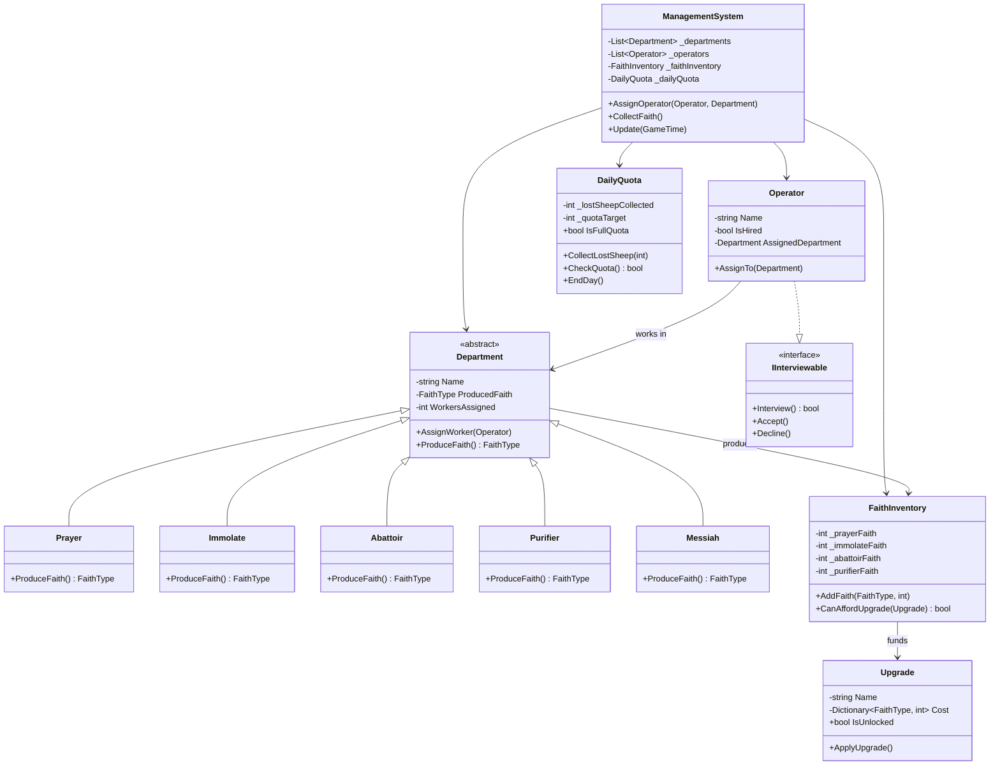

# Class Diagram — [ไม่มี]

```mermaid
classDiagram
    class ManagementSystem {
        -List~Department~ _departments
        -List~Operator~ _operators
        -FaithInventory _faithInventory
        -DailyQuota _dailyQuota
        +AssignOperator(Operator, Department)
        +CollectFaith()
        +Update(GameTime)
    }

    class Department {
        <<abstract>>
        -string Name
        -FaithType ProducedFaith
        -int WorkersAssigned
        +AssignWorker(Operator)
        +ProduceFaith() FaithType
    }

    class Prayer {
        +ProduceFaith() FaithType
    }
    class Immolate {
        +ProduceFaith() FaithType
    }
    class Abattoir {
        +ProduceFaith() FaithType
    }
    class Purifier {
        +ProduceFaith() FaithType
    }
    class Messiah {
        +ProduceFaith() FaithType
    }

    class FaithInventory {
        -int _prayerFaith
        -int _immolateFaith
        -int _abattoirFaith
        -int _purifierFaith
        +AddFaith(FaithType, int)
        +CanAffordUpgrade(Upgrade) bool
    }

    class Upgrade {
        -string Name
        -Dictionary~FaithType, int~ Cost
        +bool IsUnlocked
        +ApplyUpgrade()
    }

    class IInterviewable {
        <<interface>>
        +Interview() bool
        +Accept()
        +Decline()
    }

    class Operator {
        -string Name
        -bool IsHired
        -Department AssignedDepartment
        +AssignTo(Department)
    }

    class DailyQuota {
        -int _lostSheepCollected
        -int _quotaTarget
        +bool IsFullQuota
        +CollectLostSheep(int)
        +CheckQuota() bool
        +EndDay()
    }

    ManagementSystem --> Department
    ManagementSystem --> Operator
    ManagementSystem --> FaithInventory
    ManagementSystem --> DailyQuota
    Department <|-- Prayer
    Department <|-- Immolate
    Department <|-- Abattoir
    Department <|-- Purifier
    Department <|-- Messiah
    Department --> FaithInventory : produces
    FaithInventory --> Upgrade : funds
    Operator ..|> IInterviewable
    Operator --> Department : works in
```
